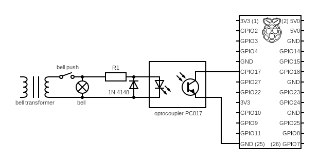

# Simple doorbell MQTT tool

This is a simple tool that listenes to a GPIO pin of a Raspberry Pi and sends a MQTT message when the pin is triggered. It
is intended to be used with an analog doorbell system that is used in many houses.

## Circuit



Depending on the transformer output voltage, you may need to adjust the R1 resistor:

| Voltage | R1   |
| ------- | ---- |
| 8V      | 330  |
| 12V     | 560  |
| 16V     | 1.2k |

I use GPIO 17 in this example, but you can use any other GPIO pin.

## Building

I use cross to build the binary for the Raspberry Pi. You can install it with:

```bash
$ cargo install cross
```

Then you can build the binary with:

```bash
$ cross build
```

## Installation

Copy the binary to your Raspberry Pi. You can use the provided systemd service file to run it as a service. In this case copy
the binary to /usr/bin/doorbell and the service file to /etc/systemd/system/doorbell.service.
Finally you need a configuration file in /etc/doorbell/config.toml. Here is an example:

```toml
mqtt_url = "ssl://server:8883"
mqtt_username = "user"
mqtt_password = "password"
mqtt_topic = "doorbell"
mqtt_message = "Ding Dong"
gpio_pin = 17
```

Now enable and start the service:

```bash
$ sudo systemctl enable doorbell
$ sudo systemctl start doorbell
```

You might need to adjst the service file to your needs. The user that is used to run the service needs access to the GPIO pins. This
is usually the case for the user `pi`. In case your MQTT server is running on a different host, you might need to adjust the After part
of the service file. Remove the `mosquitto.service`.
